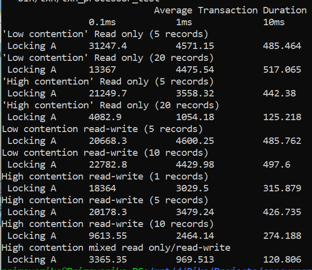
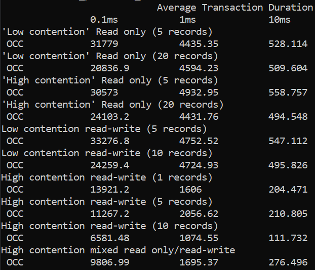
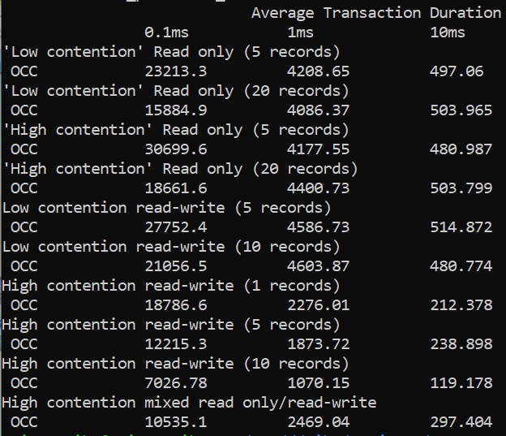
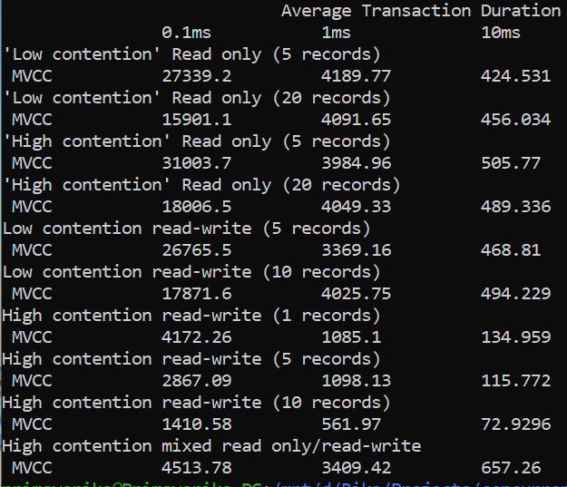
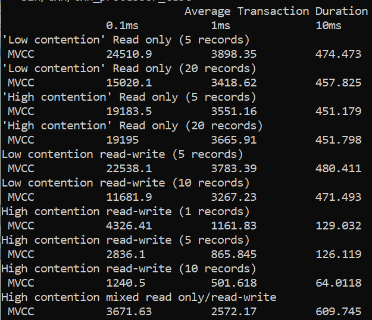
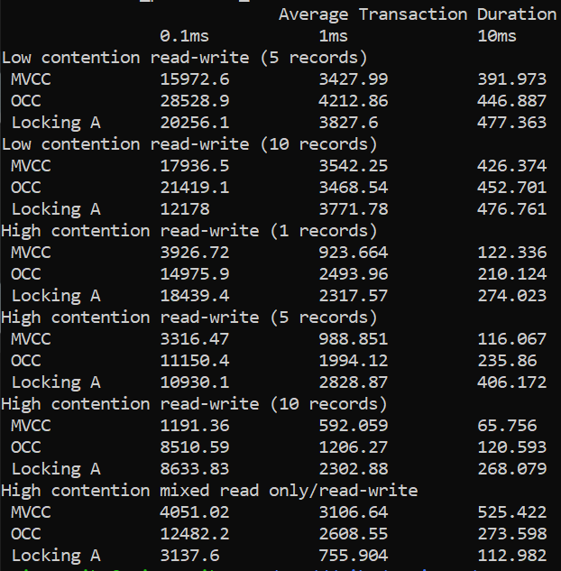
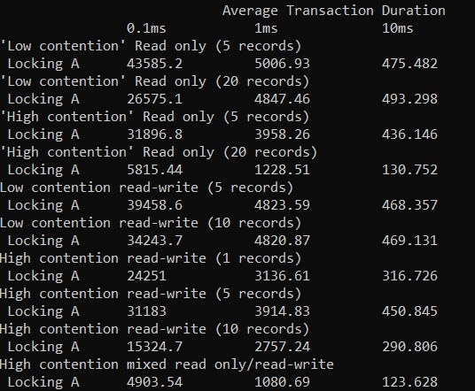

# Concurrency Control Protocol

-------

First of all, this task or project is mainly based on [this repo](https://github.com/dhatch/database-concurrency-control).

For the instruction of the task and algorithm could be seen from `instruction.txt`

This code is mainly for testing performance (benchmarking) each concurrency control algorithm in C++.

## Algorithm Tested

-------

1. Exclusive-only Simple Locking
2. Serial Optimistic Concurrency Control (OCC)
3. Multiversion Timestamp Ordering Concurrency Control (MVCC)

## Requirement

-------
To run this program you should have

1. C++ compiler
2. GNU Make
3. Linux-based OS (haven't tested in Windows or macOS)

## How to Run

-------
Just execute

    make test

in the terminal with root project directory as the terminal path. 

## Testing Result

-------
We perform benchmarking on some devices, and here is testing result based on our first device (HP Pavilion Laptop -> RAM: 16gb; CPU: 8 cores (Intel Core i7 8th Gen))

1. Exclusive-only Simple Locking
    
   First test

   

   Second test

   

2. Serial Optimistic Concurrency Control (OCC)
   
    First test 

    

    Second test

    
    
3. Multiversion Timestamp Ordering Concurrency Control (MVCC)
   
   First test

   

   Second test

   

4. Comparison
   
    First test

    

Then here is testing result based on our second device (RAM: 8gb, CPU Core: 6, Thread : 12 (Intel Core i7-9750 9th Gen))
1. Exclusive-only Simple Locking
    First test

    

    Second test

    
2. Serial Optimistic Concurrency Control (OCC)
   
    First test

    

    Second test

    
    
3. Multiversion Timestamp Ordering Concurrency Control (MVCC)
   
   First test

   

   Second test

   

## Analysis

-------